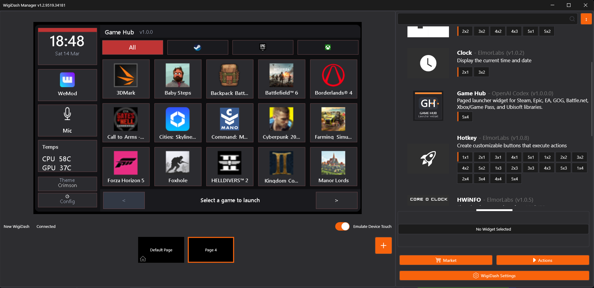
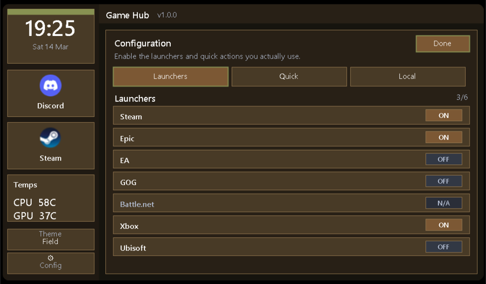
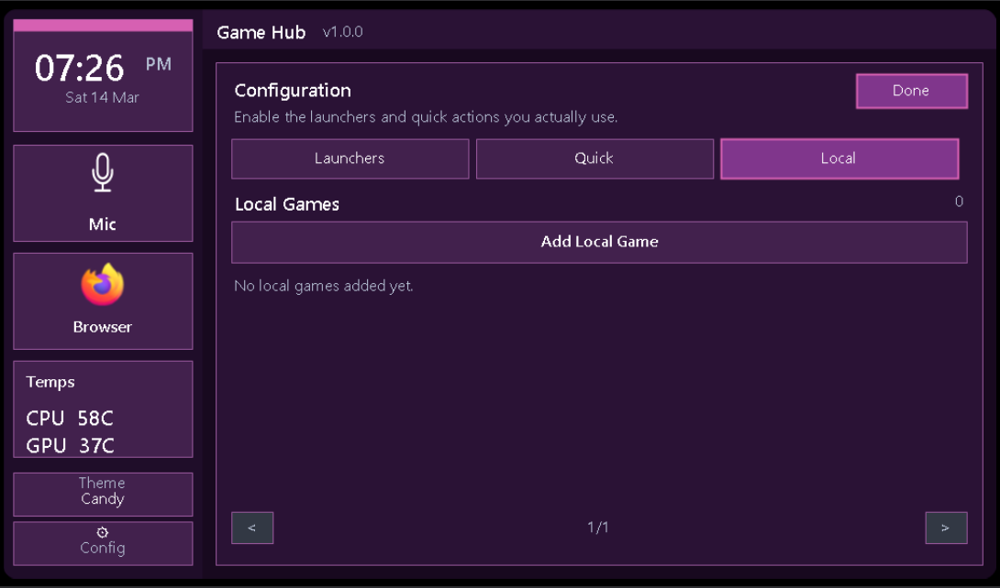
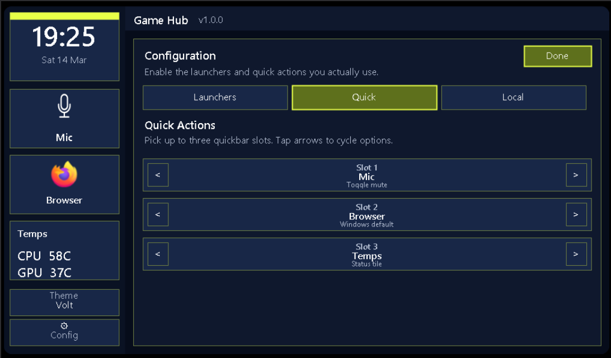

# Game Hub


## Screenshots







`Game Hub` is a custom `5x4` WigiDash widget for browsing and launching PC games from one touch-friendly dashboard.

Current release: `v1.0.0`
WigiDash Manager version: `v1.2.9519.34181`


## Features

- scans installed games from `Steam`, `Epic`, `EA`, `GOG Galaxy`, `Battle.net`, `Xbox / Game Pass`, and `Ubisoft Connect`
- hides Steam games marked as hidden
- supports manual local-game import from the widget config UI
- lets you filter by enabled launchers
- uses a safer flow: select first, then launch
- includes 3 configurable quickbar slots
- supports launcher buttons, `WeMod`, `Discord`, default browser, `Mic Mute`, and `Temps` in the quickbar
- shows CPU / GPU sensors through the WigiDash framework
- supports multiple themes, theme persistence, and 24h / 12h clock modes
- stores settings per widget instance
- is tuned for `5x4` only

## Requirements

- Windows
- WigiDash Manager installed
- Visual Studio Build Tools / MSBuild if you want to build from source

## Install

Install the packaged widget by copying the included widget folder into:

`%AppData%\G.SKILL\WigiDashManager\Widgets\`

The package contains this folder:

`8A9E2A7E-6B91-4D93-8C87-03B93BC0A6B7`

Widget state is created automatically on first run and stored separately in:

`%AppData%\G.SKILL\WigiDashManager\Widgets\GameHub Config\`

Notes:

- unavailable launchers stay visible in config as `N/A`, but cannot be enabled
- a fresh widget enables available launchers up to the current limit
- Battle.net titles may open the Battle.net client first if Blizzard’s own shortcut flow does the same

## Build

Use MSBuild through the provided script:

```powershell
powershell -ExecutionPolicy Bypass -File .\scripts\Build-GameHubWidget.ps1
```

This rebuilds [GameHub.Widget.csproj](/g:/vscode%20workspace/GameHub/src/GameHub.Widget/GameHub.Widget.csproj) with the installed Visual Studio Build Tools instance.

## Package

To create a release zip:

```powershell
powershell -ExecutionPolicy Bypass -File .\scripts\Package-GameHubWidget.ps1 -Version 1.0.0
```

This produces:

- `dist\GameHub.Widget-1.0.0\`
- `dist\GameHub.Widget-1.0.0.zip`

The package includes:

- widget DLL
- `GameHub.Core.dll`
- matching `.pdb` files
- `preview_5x4.png`
- `thumb.png`
- `INSTALL.txt`

## Project Structure

- `GameHub.sln`
- `src/GameHub.Core`
- `src/GameHub.Widget`
- `scripts/Build-GameHubWidget.ps1`
- `scripts/Export-GameHubWidgetAssets.ps1`
- `scripts/Package-GameHubWidget.ps1`

## Sharing

The deployed widget folder can be zipped and shared as-is.

Personal widget settings are not stored inside the deployed widget folder, so sharing the widget does not carry over a user’s config automatically.

## Build Notes

The widget project references `WigiDashWidgetFramework.dll` from the normal local WigiDash install path, so contributors need WigiDash installed to build it locally.
